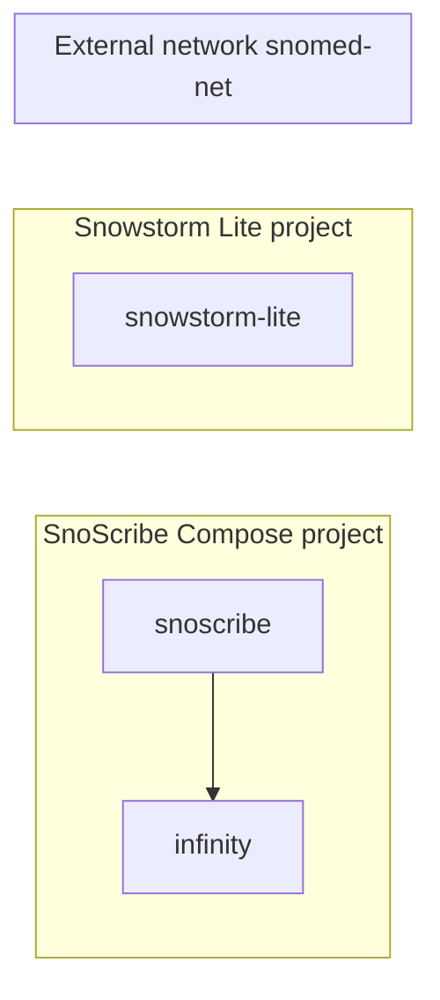

# Run: Snowstorm Lite + SnoScribe (separate Docker Compose)

Use [Snowstorm Lite](https://github.com/IHTSDO/snowstorm-lite) as a local SNOMED CT FHIR terminology server while SnoScribe runs in its own Compose stack. Each project keeps its own `docker-compose.yml`; both attach to a **shared external network** so the SnoScribe container can reach Snowstorm by container hostname.

Snowstorm Lite exposes FHIR at `/fhir` (for example `http://snowstorm-lite:8080/fhir` on the Docker network).

## When to use this

- You want terminology queries to stay on your machine (not the public Snowstorm demo).
- Snowstorm Lite and SnoScribe are managed as separate Compose projects.
- SnoScribe runs in Docker — `localhost` inside the `snoscribe` container does **not** reach other containers or the host.

If SnoScribe runs on the host with `mvn spring-boot:run`, point `fhir.tx.url` at the host-mapped port instead (for example `http://localhost:8080/fhir`). See [development.md](../development.md).

## Overview



1. Create a shared network (`snomed-net`).
2. Start Snowstorm Lite on that network.
3. Start SnoScribe with `docker-compose.snomed-net.yml` merged in.
4. Set `FHIR_TX_URL=http://snowstorm-lite:8080/fhir` in `.env`.

## Prerequisites

- Docker Compose v2
- Snowstorm Lite image: `snomedinternational/snowstorm-lite`
- A SNOMED CT edition loaded in Snowstorm Lite (syndication or manual import per [Snowstorm Lite quick start](https://github.com/IHTSDO/snowstorm-lite#quick-start))
- SnoScribe stack — [docker-ollama.md](docker-ollama.md) or [docker-cloud-llm.md](docker-cloud-llm.md)

## Step 1: Create the shared network

Run once on the host:

```bash
docker network create snomed-net
```

## Step 2: Start Snowstorm Lite

### Option A: `docker run`

```bash
docker pull snomedinternational/snowstorm-lite:latest

docker run -d \
  --name snowstorm-lite \
  --network snomed-net \
  -p 8080:8080 \
  -v snowstorm-lite-volume:/app/lucene-index \
  snomedinternational/snowstorm-lite:latest \
  --index.path=lucene-index/data \
  --admin.password=yourAdminPassword
```

Add `--syndicate --version-uri=...` if you want automatic edition download (see Snowstorm Lite docs). Wait until indexing completes and `http://localhost:8080/fhir/metadata` responds on the host.

### Option B: Separate Compose project

In a directory for Snowstorm Lite, create `docker-compose.yml`:

```yaml
services:
  snowstorm-lite:
    image: snomedinternational/snowstorm-lite:latest
    container_name: snowstorm-lite
    ports:
      - "8080:8080"
    volumes:
      - snowstorm-lite-volume:/app/lucene-index
    command:
      - --index.path=lucene-index/data
      - --admin.password=yourAdminPassword
    networks:
      - snomed-net

networks:
  snomed-net:
    external: true

volumes:
  snowstorm-lite-volume:
```

```bash
docker compose up -d
```

Use `container_name: snowstorm-lite` (or a stable service name) so SnoScribe can use that hostname on the network.

## Step 3: Configure SnoScribe

In the SnoScribe project `.env`:

```bash
FHIR_TX_URL=http://snowstorm-lite:8080/fhir
```

Use the **container name** and Snowstorm’s **internal port** (`8080`). Do not use `localhost` — that refers to the SnoScribe container itself.

## Step 4: Start SnoScribe on the shared network

Merge [docker-compose.snomed-net.yml](../../docker-compose.snomed-net.yml) so only the `snoscribe` service joins `snomed-net` (it stays on the default project network to reach `infinity`).

**Ollama stack:**

```bash
docker compose \
  -f docker-compose.yml \
  -f docker-compose.ollama.yml \
  -f docker-compose.snomed-net.yml \
  up --build
```

**Cloud LLM stack:**

```bash
docker compose \
  -f docker-compose.yml \
  -f docker-compose.cloud-llm.yml \
  -f docker-compose.snomed-net.yml \
  up --build
```

## Verify

From the host (Snowstorm port published):

```bash
curl -sf http://localhost:8080/fhir/metadata | head
```

From the SnoScribe container (Docker DNS between containers):

```bash
docker exec snoscribe-app curl -sf http://snowstorm-lite:8080/fhir/metadata | head
```

Then open **http://localhost:8080**, submit a note, and confirm annotations resolve SNOMED codes without terminology errors.

## Troubleshooting

| Symptom | Likely cause |
|---------|----------------|
| Connection refused from `snoscribe-app` to `snowstorm-lite` | Snowstorm not on `snomed-net`, or SnoScribe started without `docker-compose.snomed-net.yml` |
| `Could not resolve host: snowstorm-lite` | Container name mismatch — align `FHIR_TX_URL` with Snowstorm’s `container_name` or service name |
| Metadata works but no SNOMED matches | Edition not loaded or still indexing — check Snowstorm dashboard / logs |
| Works on host, fails in Docker | Using `localhost` in `FHIR_TX_URL` instead of `http://snowstorm-lite:8080/fhir` |

**Linux hosts:** If Snowstorm runs on the host (not in Docker) and SnoScribe is in Docker, use `http://host.docker.internal:8080/fhir` (Docker Desktop) or the host gateway IP — not `localhost` from inside the container.

**Ad-hoc test:** Attach an existing container without recreating:

```bash
docker network connect snomed-net snoscribe-app
```

This is lost when the container is recreated; prefer the compose override for a permanent setup.

## See also

- [configuration.md](../configuration.md) — `FHIR_TX_URL` / `fhir.tx.url`
- [docker-ollama.md](docker-ollama.md) / [docker-cloud-llm.md](docker-cloud-llm.md) — SnoScribe stacks
- [Snowstorm Lite](https://github.com/IHTSDO/snowstorm-lite) — edition loading and admin UI
